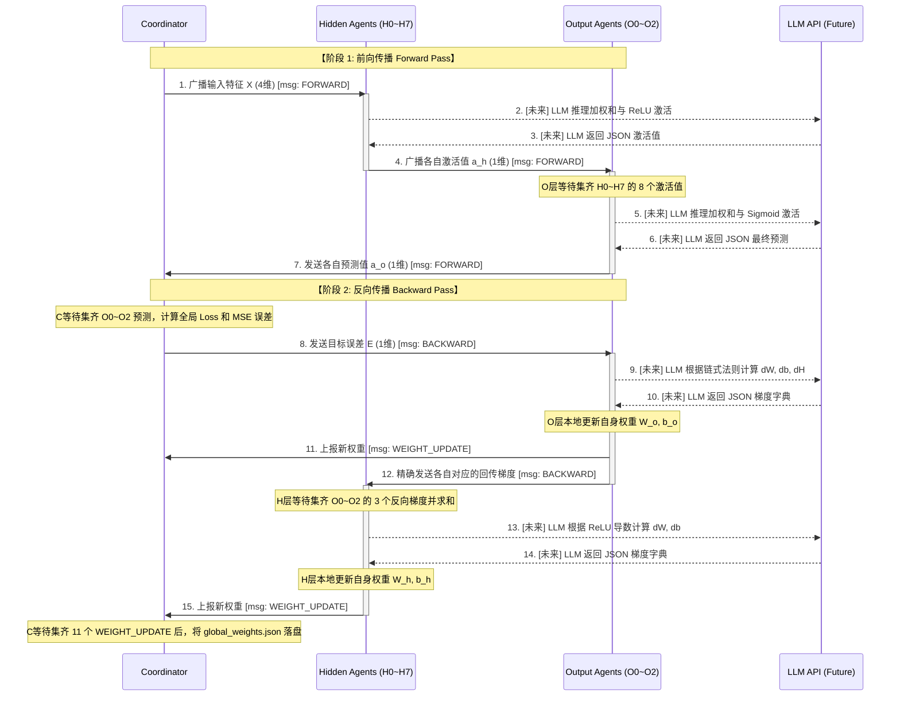

# 系统工作方式与信息流向 (System Workflow & Data Flow)

本文档旨在描述当前多智能体 BP 神经网络架构的内部信息流向，特别是协调器 (Coordinator) 与各层 Agent 之间的数据交互过程。

## 一、 整体信息流向分析
该系统由 **11个独立运行的协程 (Agent)** 和 **1个全局指挥官 (Coordinator)** 组成。所有的交互基于**完全解耦的消息队列 (asyncio.Queue)**。

### 当前阶段 (本地模拟)
- **Coordinator**: 负责串行发放 Iris 样本、监控是否收齐结果、触发反向误差、汇总全局权重。
- **NeuronAgent (CPU)**: 接收输入，执行 `numpy` 矩阵运算，发送前向激活或反向梯度。

### 未来阶段 (LLM 驱动)
大模型将**替换 NeuronAgent 内部的数学计算部分**，而系统的信息流向和通信协议维持不变。

## 二、 核心工作流 (单步训练时序图)

以下 Mermaid 流程图展示了**一个样本**的前向传播 (Forward) 与反向传播 (Backward) 完整闭环：

## 三、 大模型 (LLM) 参与的位置分析

1. **当前大模型参与的位置：【无】**
   - 当前代码 (`src/core/neuron_agent.py`) 采用纯粹的 Numpy 计算（参见 `_handle_forward` 和 `_handle_backward`）。
   - 这是由于我们需要首先验证多节点异步通信、队列死锁、超时处理等工程问题，确保脚手架稳定。

2. **未来大模型需要参与的位置：【替代 Agent 的数学核心】**
   - **前向计算阶段**：大模型需要阅读 $W, b, X$ 和激活函数定义，通过推理过程生成标量输出。
   - **反向求导阶段**：大模型需要基于当前的前向缓存 $X$、收到的误差 $E$、以及自身的激活函数，利用链式法则进行推导。
   - **JSON 解析阶段**：Agent 将拦截并解析大模型返回的内容，提取出 `activation` 或 `dW, db`，再由系统负责将消息发给下游。

3. **大模型【不】参与的位置：【系统通信与路由】**
   - 所有的信令路由（如 H3 发给 O1，Coordinator 收发消息）仍然由原生的 `asyncio.Queue` 处理。
   - 这确保了多智能体网络拓扑的稳定性，防止大模型产生幻觉向错误节点发消息。